```mermaid
    flowchart TD
    User("Spotify Premium User 🎵")
    Authenticate("Authenticate via Spotify OAuth 🔐")
    Browse("Browse Songs, Artists, Albums 🎶")
    Search("Search Songs & Artists 🔍")
    GameModes{"Choose Game Mode 🎮"}
    Limited("Limited Queue Mode (5 Songs) 🎧")
    Limitless("Limitless Mode (End Anytime) 🎵")
    Play("Play Song Previews ▶️")
    Like("Like Song ❤️")
    Dislike("Dislike Song ❌")
    Recommendations("Receive Recommendations (Limited Mode) 🎯")
    CreatePlaylist("Create Playlist 📝")
    EditPlaylist("Edit Playlist ✏️")
    SavePlaylist("Save to Spotify 📁")
    ViewPlaylist("View Created Playlists 📂")
    Settings("Account & App Settings ⚙️")
    ThemeToggle("Toggle Light/Dark Mode 🌗")
    Logout("Logout 🚪")
    Help("Guide & How-To 📖")

    User-->Authenticate
    Authenticate-->Search
    Authenticate-->Browse
    Search-->GameModes
    Browse-->GameModes
    GameModes-->Limited
    GameModes-->Limitless
    Limited-->Play
    Limitless-->Play
    Play-->Like
    Play-->Dislike
    Limited-->Recommendations
    Like-->CreatePlaylist
    Recommendations-->CreatePlaylist
    CreatePlaylist-->EditPlaylist
    EditPlaylist-->SavePlaylist
    SavePlaylist-->ViewPlaylist
    User-->Settings
    Settings-->ThemeToggle
    Settings-->Logout
    Settings-->Help
```

<p align="center">A React Native app that gamifies Spotify playlist creation by letting users swipe through song previews, adding their favorites to a playlist.</p>

---

<!--  -->

<p align="center">
  <a href="#wireframe-designs">🎨 Wireframe Designs</a> | 
  <a href="#v2-requirement-specification">🚀 V2 Requirement Specification</a> | 
  <a href="#moscow-requirements">📊 MoSCoW Requirements</a><br>
  <a href="#user-stories">🏆 User Stories</a> | 
  <a href="#use-case">💼 Use Case</a> | 
  <a href="#how-to-set-up">🛠️ How to Set Up</a> | 
  <a href="#running-the-app">▶️ Running the App</a> | 
  <a href="#common-issues">⚠️ Common Issues</a>
</p>

---


<h2 id="wireframe-designs">🎨 Wireframe Designs</h2>

### **V1 Designs**


### **V2 Designs**


---


<h2 id="v2-requirement-specification">🚀 V2 Requirement Specification</h2>

<details>
  <summary><strong>1️⃣ Introduction</strong> 📌</summary>
  
  - **Project Overview:** This app is a gamified Spotify playlist maker that uses a Tinder-like mechanic to allows users to like or dislike song previews, After the game session, users can create and edit playlists. The app targets Spotify Premium users who enjoy curated playlists and a fun, interactive experience.
  - **Objectives:**
    - Provide a quick and engaging way to create Spotify playlists.
    - Offer two game modes for playlist creations: Limited Queue and Limitless Mode.
    - Allow users to browse, and search their msuic content (artists, albums, and playlists).
    - Enable users to edit and customise their playlists (name, description, cover image, and song selection).
  - **Target Audience:** Spotify Premium users who are music enthusiasts, interested in curated playlists for scenarios like parties, road trips, or casual listening.
</details>

<details>
  <summary><strong>2️⃣ Scope</strong> 🎯</summary>
  
  - **In-Scope:**
    - Gamified playlist creation with Tinder-like mechanics.
    - Two game modes: Limited Queue, and Limitless Mode.
    - Playlist editing (name, description, cover image, song selection).
    - Browsing and searching for songs, artists, albums, and playlists.
    - Dedicated screen for created playlists, account settings, and home navigation.
    - Integration with Spotifys API for music data and playlist management.
  - **Out-of-Scope:**
    - Offline functionality (requires an internet connection).
    - Social features (e.g., sharing playlists on social media).
</details>

<details>
  <summary><strong>3️⃣ Functional Requirements</strong> ⚙️</summary>
  
  - **User Roles:**
    - **Spotify Premium User:** Can create a Swipify account, link their Spotify account, create playlists, browse content, and use gamified features.
  - **Core Features:**
    - **Home Screen:**
        - Navigation between content screens (e.g. followed artists, followed playlists, liked albums, created playlists).
        - Search functionality to find songs and artists.
        - Ability to initiate the game by selecting a song or artist.
    - **Gamified Playlist Creation:**
        - **Tinder-like mechanics:** Users can like or dislike song previews.
        - **Limited Queue Mode:**
            - Provides 5 associated songs based on the selected song.
            - Recommendations are generated based on liked songs.
        - **Limitless Queue Mode:**
            - Continuous stream of tracks.
            - Users can finish their game at any time using a button.
            - Liked songs are added directly to the playlist without recommendations.
    - **Playlist Editing:**
        - Edit playlist name, description, and cover image.
        - View and edit the list of songs to be added to the playlist.
        - Button to create the playlist (Uses API to create the playlist on their account).
    - **Dedicated Playlist Screen:**
        - Display all paylists created with Swipify.
        - Option to open and view existing playlists.
    - **Account and Settings Screen:**
        - Display user details (e.g. Spotify Account Information).
        - Toggle app theme between light and dark.
        - option change playlist privacy options when creating playlists.
        - Guide on how to use Swipify.
        - Buttons for: 
            - Opening Spotify Account in Spotify.
            - Clear Cache (e.g. Stored playlists, liked albums, etc).
            - Logout Button.
    - **Search Functionality:**
        - Search for songs, artists and playlists across Spotify's library.
        - Display search results with options to select and initiate the game.
</details>

<details>
  <summary><strong>4️⃣ Non-Functional Requirements</strong> 🛠️</summary>
  
  - **Performance:** 
    - Minimal lag for smooth user experience.
  - **Security:**
    - Secure authentication via Spotify OAuth.
    - Sensitive information (like user details) is encrypted and stored securely.
  - **Usability:**
    - Intuitive and user-friendly interface.
    - Accessible design compliant with WCAG 3.0 standards.
  - **Compatibility:**
    - Support for iOS and Android devices.
    - Compatible with Spotify Premium accounts.
  - **Reliability:**
     - App should handle API errors gracefully.
</details>

<details>
  <summary><strong>5️⃣ Technical Requirements</strong> 💻</summary>
  
  - **Technology Stack:**
    - **Frontend:** React Native.
    - **Backend:** Node.js.
    - **Database:** [unknown].
    - **APIs:** Spotify Web API for authentication, music data, and playlist management.
  - **APIs:**
    - Fetching song previews.
    - Searching for songs and artists.
    - Creating and editing playlists.
    - OAuth.
  - **Data Management:**
    - Store user preferences (e.g. liked songs, created playlists) locally.
    - Sync playlists with Spotify.
  - **DevOps:**
    - Version control using Github.
</details>

---


<h2 id="moscow-requirements">📊 MoSCoW Requirements</h2>

<details>
  <summary><strong>Must Have</strong> ✅</summary>
  These are the core features without which the app cannot function or deliver value to the users.

- **Spotify Integration:**
    - Authenticate users via Spotify OAuth
    - Fetch song previews, artist, track, and album data, and playlist information using the Spotify API.
    - Save created playlists to the user's spotify account.
- **Gamified Playlist Creation:**
    - Tinder-like mechanics for liking/disliking song previews.
    - Two game modes:
        - **Limited Queue Mode:** 5 associated songs based on the selected song.
        - **Limitless Mode:** Continuous stream of tracks with the ability to finish at any time.
    - Generate recommendations based on liked songs (for Limited Queue Mode).
- **Playlist Editing:**
    - Edit playlist name, description, and cover image.
    - View, and edit the list of songs to be added to the playlist.
    - Save the playlist to spotify.
- **Home Screen:**
    - Navigation between content screens (e.g. followed artists, followed playlists, liked albums, and created playlists).
    - Search functionality to find songs and artists.
- **Dedicated Playlist Screen:**
    - Display all playlists created with the app.
    - Open and browse existing playlists.
- **Account and Settings Screen:**
    - Display user details (Spotify account information).
    - Theme toggle, and playlist privacy setting.
    - Detailed, and visual guide on how to use Swipify.
    - Clear cache, and Logout functionality
- **Accessibility:**
    - **Screen Reader Support:**
        - Ensure all UI elements are accessible and focusable to screen readers (e.g. VoiceOver on iOS, and TalkBack on Android).
        - Provide meaningful labels for buttons, images, and other interactive elements and content.
    - **Colour Contrast:**
        - Maintain a minimum colour contrast ratio of 4:5:1 for text and interactive elements.
        - Avoid relying solely on colour to convey information (e.g. use icons or text labels).
    - **Error Handling:**
        - Provide clear and descriptive error messages.
        - Ensure errors are announced by screen readers.
</details>

<details>
  <summary><strong>Should Have</strong> 🤔</summary>
These features add significant value but are not essential for use.
- **Search Enhancements:**
    - Filter search results by songs, artists, albums, or playlists.
    - Display more detailed information about search results (e.g. release date).
- **Playlist Customisation:**
    - Add custom tags or genres to playlists.
    - Reorder songs in the playlist.
- **Performance Optimisation:**
    - Cache frequently accessed data (e.g. followed artists, followed playlists, followed albums etc) to reduce load times.
    - Implement lazy loading for content screens.
- **Accessibility:**
    - Support dynamic content and text resizing to accommodate users with visual impairments.
    - Ensure the UI adapts to larger text sizes without breaking the layout.
</details>

<details>
  <summary><strong>Could Have</strong> 🌟</summary>
These features are desirable but can be deferred to future updates.
- **Social Features:**
    - Share created playlists with friends via social media or messaging apps.
    - View friends and followers Spotify profile and playlists.
- **Analytics and Insights:**
    - Provide users with insights into their music preferences (e.g. most liked genres, top artists).
- **Advanced Game Modes:**
    - Introduce themes or genres for playlist creation (e.g. "80s Hits", "Road Trip Vibes").
</details>

---


<h2 id="user-stories">🏆 User Stories</h2>

| ID | UserStory | Priority | Epic | Acceptance Criteria |
| -- | --------- | -------- | ---- | ------------------- |
| US1-A | As a Spotify Premium User, I want to authenticate via Spotify OAuth so my account is securely linked. | Must | Secure Spotify integration | Secure OAuth flow; error handling for invalid credentials. |
| US2-N | As a user, I want to navigate between "Followed Artists", "Liked Albums", and "Created Playlists" screens for easy access to my content. | Must | Navigation. | Tabs or menu buttons for each section; smooth transitions. |
| US3-N | As a user, I want to search for songs, and artists to start a game session. | Must | Searching. | Search bar with real-time results; option to select a song, or artist. |
| US4-G | As a user, I want to swipe left/right on song previews to build a playlist quickly. | Must | Gamified Swiping | Tinder-like swipe gestures; go back option; 30-second previews; minimal lag. |
| US5-G | As a user, I want to choose between **Limited Queue Mode** or **Limitless Mode**. | Must | Modes | Clear mode selection UI; Limited Mode shows 5 recommendations; Limitless allows stopping anytime. |
| US6-G | As a user, I want recommendation in **Limited Mode** to match my liked songs. | Must | recommendations | Songs align with genre/tempo of liked tracks. |
| US7-M | As a user, I want to edit playlist names, descriptions, and cover images before saving. | Must | Editing | Editable fields; image upload/ crop functionality. |
| US8-M | As a user, I want to remove songs from my playlist before saving it to Spotify | Must | Editing | Swipe gesture to remove track; undo option. |
| US9-M | As a user, I want to save playlists directly to my Spotify Account. | Must | Saving | "Create Playlist" button; confirmation message. |
| US10 | As a visually impaired user, I want screen readers to announce UI elements | Must | Inclusive design for all users. | VoiceOver/TalkBack support; meaningful labels for buttons/ images. |
| US11-A | As a user, I want high colour contrast and non color-dependent cues. | Must | Inclusive design for all users. | 4:5:1 contrast ration; icons/text labels for actions. |
| US12-A | As a user, I want to toggle between light/dark mode| Must | User Preference. | Theme switch in settings; immediate UI update. |
| US13-A | As a user, I want a guide to learn how to use Swipify. | Must | User Experience. | In-app tutorial with visuals; accessible from settings |

---


<h2 id="use-case">💼 Use Case</h2>



---


<h2 id="how-to-set-up">🛠️ How to Set Up</h2>

1. **Install Dependencies:**
   ```sh
   npm install
   ```
2. **Set Up `.env` File:**
   ```plaintext
   SPOTIFY_CLIENT_ID=your_spotify_client_id
   SPOTIFY_CLIENT_SECRET=your_spotify_client_secret
   SCOPES=user-read-private user-read-email ugc-image-upload playlist-modify-public playlist-modify-private streaming user-read-playback-state user-modify-playback-state
   ```
3. **Configure Spotify Developer Dashboard:**
   - Go to the [Spotify Developer Dashboard](https://developer.spotify.com/) and set up a new Spotify app.
   - Fill in the app's name and description, and select "Web API" and "Web Playback SDK".
   - In the **Redirect URIs** section, add the IP address you'll be using to run the app (see below).
   - Once your app is created, copy the `Client ID` and `Client Secret` from the Spotify Developer Dashboard and paste them into your `.env` file.

---


<h2 id="running-the-app">▶️ Running the App</h2>

1. **Start the App:**
   ```sh
   expo start
   ```
   - After starting, make a note of the IP address shown under the label `Metro waiting on:`. It should look something like:
    ```
    exp://10.124.188.108:8081
    ```
2. **Ensure correct Redirect URI setup in Spotify Developer Dashboard.**
   - Go back to your [Spotify Developer Dashboard](https://developer.spotify.com/) and paste the noted IP address (from the `expo start` output) as the **Redirect URI** in the Spotify app settings.
    ---
3. **Authenticate and start swiping!**
   - When prompted, log in to your Spotify account to authorize the app.
   - The app should now be able to fetch your Spotify data and interact with your playlists.

---


<h2 id="common-issues">⚠️ Common Issues</h2>

### **Access Token Expired**
   - If you authenticate with Spotify and get the error "The access token expired," try restarting the app.
   - This can happen when the token expires due to inactivity or long usage. Simply restarting the app should resolve the issue.
   - If the problem persists after restarting, reauthenticate and restart the app again.

### **Redirect URI Error**
   - If you encounter errors related to the Redirect URI, double-check that the IP address in your developer dashboard matches the one shown when you run `expo start`.

---